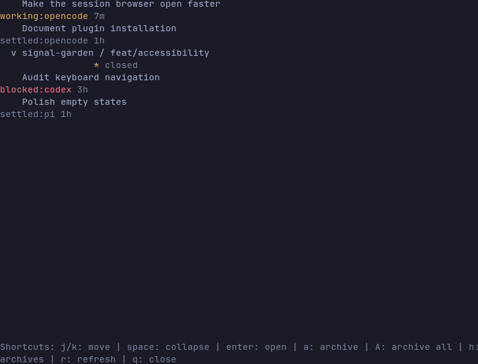

# Herdr Project Sessions

## About

Herdr Project Sessions is a Linux plugin for Herdr that puts Git projects,
worktrees, live coding-agent panes, and historical OpenCode sessions into one
keyboard-driven browser. It helps people find older agent work, return to the
right worktree, resume a session, and keep settled sessions out of the main
working list without deleting any underlying data.

It is intended for developers who use Herdr with Git worktrees and one or more
terminal coding agents. The plugin is local-first: project paths, agent state,
and session history stay on the user's machine.



The screenshot uses the built-in synthetic demo data. It contains no local
project names, paths, session IDs, or agent history.

The browser is an overlay pane because Herdr plugins cannot currently replace
the native split sidebar. It does not modify or delete project files, Git
worktrees, or agent history.

## Public Status

This repository is usable from a GitHub checkout, but it is still an early
`0.2.1` plugin. The current release is Linux-only, uses Herdr's overlay-pane
API, and has been tested with Herdr `0.7.5`. Provider resume commands must be
installed separately on the user's `PATH`.

## Features

- Groups sessions beneath their Git project and worktree.
- Shows branch, dirty state, open/closed workspace state, provider, status, and age.
- Focuses a live session in its existing Herdr pane.
- Opens a settled session in its project or worktree and resumes the provider.
- Archives settled sessions locally without deleting their provider history.
- Archives all settled sessions at once while leaving live panes alone.
- Automatically unarchives sessions after newer OpenCode activity is detected.
- Reads current Herdr state and refreshes the index on demand.

## Requirements

- Linux
- Herdr `0.7.0` or newer; tested with Herdr `0.7.5`
- Node.js with no third-party packages required
- Git for project and worktree discovery
- OpenCode's local data directory if OpenCode history should be shown

The default OpenCode paths are:

```text
~/.local/share/opencode/opencode.db
~/.local/share/opencode/storage/session
~/.local/share/opencode/storage/project
```

Override them with `OPENCODE_DATA_DIR` when using a different OpenCode data
directory.

## Install From GitHub

After this repository has been pushed, install it with Herdr's GitHub plugin
installer:

```bash
herdr plugin install nathnael-desta/herdr-project-sessions -y
herdr plugin list
```

The manifest is at the repository root, so no subdirectory argument is needed.

## Install From Source

From the repository directory:

```bash
herdr plugin link /home/nate/code/herdr-project-sessions
herdr plugin list
```

The manifest registers plugin ID `nate.project-sessions` and entrypoint
`browser`. Open it directly with:

```bash
herdr plugin pane open \
  --plugin nate.project-sessions \
  --entrypoint browser \
  --placement overlay \
  --focus
```

To remove the local link without deleting this repository:

```bash
herdr plugin unlink nate.project-sessions
```

### Optional Keyboard Shortcut

Add this to `~/.config/herdr/config.toml`:

```toml
[[keys.command]]
key = "ctrl+alt+p"
type = "shell"
command = "herdr plugin pane open --plugin nate.project-sessions --entrypoint browser --placement overlay --focus"
description = "open project and session browser"
```

Reload Herdr after changing the configuration:

```bash
herdr server reload-config
```

## Use The Browser

### Navigation

| Key or action | Behavior |
| --- | --- |
| `j` / `k`, Up / Down | Move the selection |
| `Enter` on a project | Collapse or expand the project |
| `Enter` on a session | Focus or resume the session |
| `Space` | Collapse or expand the selected project |
| `r` | Refresh the project/session index |
| `q`, `Esc`, or `Ctrl-C` | Close the browser |
| Left click | Select a row; project rows collapse or expand |
| Double-click a session | Focus or resume the session |
| Mouse wheel | Move through the list |

### Session Actions

For a live session, opening it calls Herdr's agent-focus command and brings its
existing pane to the foreground.

For a settled session, opening it does the following:

1. Uses the existing project workspace when one is open.
2. Otherwise opens the Git worktree or creates a workspace for the project.
3. Creates a tab in that workspace.
4. Starts the provider's resume command with the saved session ID.

The current provider command mappings include OpenCode, Claude, Codex, Pi,
OMP, Kimi, Copilot, Droid, Qoder, Cursor, Devin, Kilo, Hermes, and MastraCode.
Unknown providers remain visible but cannot be resumed automatically.

### Archives

Archive a settled session by selecting it and pressing `a`. Press `A` in the
main view to archive every settled session currently known to the browser.
Live sessions with an open Herdr pane are never archived by these actions.

| Key | Behavior |
| --- | --- |
| `a` | Archive the selected settled session |
| `A` | Archive all settled sessions |
| `h` | Toggle between the main tree and archived sessions |
| `u` | Unarchive the selected archived session |
| `Enter` in archive view | Unarchive and open the selected session |

Archive state is stored at:

```text
~/.config/herdr/project-sessions-state/archive.json
```

Set `HERDR_PLUGIN_STATE_DIR` to use a different state directory. Each new
archive records its timestamp. While the browser is open, it checks OpenCode
session timestamps every five seconds; if a session becomes newer than its
archive timestamp because it was opened or received a prompt, it is
automatically unarchived. The same check runs when the browser opens and when
you press `r`.

Archiving only hides a session from the main browser; it does not remove
OpenCode data, terminate an agent, or delete a worktree.

## Data Model

The browser combines three sources at refresh time:

- Git worktree metadata from `git worktree list --porcelain`.
- Herdr's worktree and pane APIs for open workspaces and live agents.
- OpenCode's local SQLite/session storage for historical sessions.

The browser displays up to 500 OpenCode sessions, ordered by most recent
activity. Live agents that are not yet present in the OpenCode database are
also included when Herdr reports a session ID and working directory.

## Known Limitations

- The plugin opens as an overlay; it cannot replace Herdr's native sidebar.
- Activity polling only checks OpenCode session timestamps; press `r` for a full project and worktree refresh.
- The first launch builds the local project cache; later launches render the cache immediately and refresh it in the background.
- OpenCode history is local to the machine and is not synchronized.
- Unknown providers can be listed but cannot be resumed automatically.
- The archive is a local session-ID/timestamp list, not a provider-side archive.

## Development

The plugin has no package manager or runtime dependencies. The executable
entrypoint is `src/browser.js`, and the manifest is `herdr-plugin.toml`.

Run the available checks from the repository root:

```bash
node --check src/browser.js
node src/browser.js --dump
node src/browser.js --demo
herdr config check
```

`--dump` prints the collected project/session JSON and does not start the
interactive UI. `--demo` starts the interactive UI with fictional projects and
sessions, which is useful for screenshots and documentation. The interactive
program requires a TTY.

See [CONTRIBUTING.md](CONTRIBUTING.md) before opening a pull request.

## Troubleshooting

### The plugin does not appear

Run `herdr plugin list` and confirm that `nate.project-sessions` is enabled.
Relink the repository if Herdr still points at an old checkout:

```bash
herdr plugin unlink nate.project-sessions
herdr plugin link /home/nate/code/herdr-project-sessions
```

### No OpenCode sessions appear

Check that `~/.local/share/opencode/opencode.db` exists and that the current
user can read it. Set `OPENCODE_DATA_DIR` before opening the pane if the data
directory is elsewhere.

### A provider does not resume

The provider executable must be installed and available on `PATH`. The
provider must also report a session ID format supported by its CLI resume
command. The session will still be listed even when automatic resume is not
available.

### The browser shows stale projects or agents

Press `r` to reload Git, Herdr, and OpenCode data. The browser intentionally
does not continuously poll while idle.

## Project Layout

```text
herdr-project-sessions/
├── assets/
│   └── demo.png         # Synthetic README screenshot
├── herdr-plugin.toml  # Herdr plugin manifest
├── README.md          # User and contributor guide
└── src/
    └── browser.js     # Data collection, UI, navigation, and actions
```
